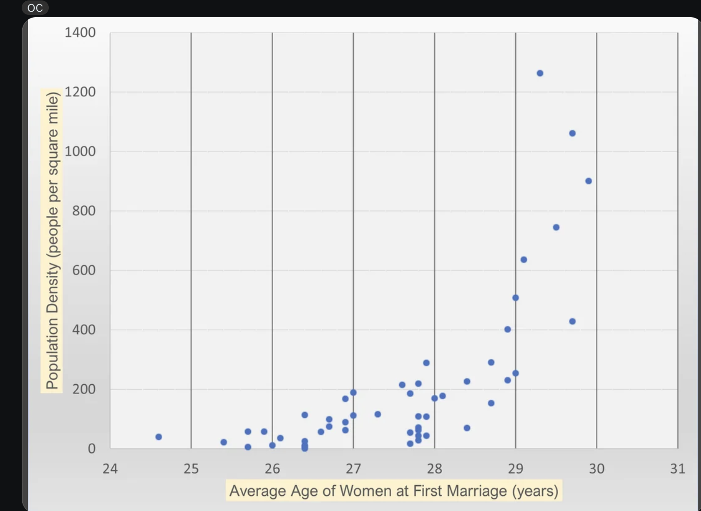

| [home page](README.md) | [visualizing debt](visualizing-government-debt) | [critique by design](critique-by-design) | [final project I](final-project-part-one) | [final project II](final-project-part-two) | [final project III](final-project-part-three) |

## Critique by Design: Redesigning Data Visualization for Better Insight
In this project, I selected a data visualization from MakeoverMonday to critique and redesign. The aim is to create a more effective representation of the data for the intended audience.
I created a standard critique mechanism based on Good Charts and Stephen Few's Data Visualization Effectiveness Profile. 

## Step one: the visualization

I chose a  visualization having title "Average Age of Women at First Marriage by State vs. State Population Density [OC]". This scatter plot compares the average age of women at first marriage across different states in the United States with each state's population density.

Source - https://www.reddit.com/r/dataisbeautiful/comments/wzx70h/average_age_of_women_at_first_marriage_by_state/

The scatter plot aims to depict a relationship between the average age of women at first marriage and state population density. The x-axis represents the average age, while the y-axis shows the population density per square mile. The plot suggests a potential trend where states with higher population densities tend to have a higher median age of first marriage, indicating that women in densely populated areas might marry later.

In the upcoming steps, I will critique this design, propose new ideas and redesigns to improve its effectiveness in conveying the data.

## Step two: the critique

Based on Stephan Few's Data Visualization Effectiveness Profile and Good charts, I have evaluated the visualization as follows - 

1) Visual Effectiveness Summary -

Usefulness (Rating: 4/10)
The chart provides some insight into the relationship between population density and the average age of women at first marriage across states. However, its usefulness is limited because it lacks clear labels or identifiers for individual states making it difficult to decipher valuable context and make actionable insights.

Completeness (Rating: 3/10)
The scatter plot does not include key information like state labels or a clear description of what the clusters represent. Additionally, the title suggests a comparison across states, but the states themselves are not identifiable on the plot. Including data labels, a legend, and trend lines could enhance the completeness of the visualization.

Perceptibility (Rating: 3/10)
The scatter plot is difficult to interpret. The clustering of points near the lower end of the population density axis makes it hard to see individual data points. The exact values of age and population density are also unclear as we need to tilt our head to view the data, which complicates interpretation. Changing the Y-axis to a logarithmic scale and including state labels could improve clarity.

Truthfulness (Rating: 7/10)
Given the specifcity of the data points, it looks like the scatter plot is accurate. It does, however, imply a correlation between population density and marriage age, which might lead to assumptions about causation. While it truthfully displays the data, the lack of explanatory context can lead to misinterpretation.

Intuitiveness (Rating: 3/10)
The scatter plot format is familiar, but the lack of labels for states and the difficulty in reading exact values makes it less intuitive. Annotations such as hover-over details, would help make the plot easier to understand.

Aesthetics (Rating: 5/10)
The plot is visually clean, but it is quite plain and does not use color effectively to enhance understanding. Using color gradients to represent different regions or clustering could make it more visually appealing and informative.

Engagement (Rating: 4/10)
The scatter plot does show a potential trend between age and population density, which could spark interest. However, the lack of labels and context reduces its overall engagement. Including annotations or a trend line would draw the viewer more into the data and encourage further exploration.

While the scatter plot seems accurate, it lacks in usefulness, completeness, aesthetics and clarity due to the absence of state labels, annotations, and effective use of color.

2) Contextual Summary - 

The scatter plot effectively hints at a potential trend between population density and the average age of first marriage, with data points accurately representing this relationship. However, it lacks key elements such as state labels, a clear title, and a trend line, making it difficult to interpret and limiting its usefulness for state-wise analysis. To improve clarity and accessibility, the visualization could be redesigned as a horizontal bar chart with states on the y-axis and median age on the x-axis, using hover interactions to reveal population density. A divergent color scheme and footnotes comparing state data to the U.S. median would further enhance its contextual effectiveness. This approach would make the data more accessible to economists, policymakers, and other stakeholders who rely on this information for decision-making.

## Step three: Sketch a solution

Based on my critique, I opted for a horizontal bar chart with states on the y-axis and population density on the x-axis. Each state is represented by two bars for different time frames, with hover-over interactions enabled to display the average age on each bar. The chart is sorted from highest to lowest in terms of population density and median age.

I chose this approach because I believe the audience would be most interested in quickly identifying the states with the highest and lowest values. Additionally, a bar chart more effectively visualizes trends than a scatter plot, as it directly captures the trend without requiring the audience to interpret clusters of data points. I ensured all the parameters like state labels, time-frame, median age and population density per square mile was covered in one chart. I also modified the chart title as - "State-wise Comparison of Median Age At First Marriage and Population Density"

This redesign aims to present the data in a better way, allowing for easier trend identification and a comprehensive state-wise analysis.

<noscript></noscript><object class='tableauViz'  style='display:none;'><param name='host_url' value='https%3A%2F%2Fpublic.tableau.com%2F' /> <param name='embed_code_version' value='3' /> <param name='site_root' value='' /><param name='name' value='State-wiseComparisonofMedianAgeAtFirstMarriageandPopulationDensity&#47;Sheet1' /><param name='tabs' value='no' /><param name='toolbar' value='yes' /><param name='static_image' value='https:&#47;&#47;public.tableau.com&#47;static&#47;images&#47;St&#47;State-wiseComparisonofMedianAgeAtFirstMarriageandPopulationDensity&#47;Sheet1&#47;1.png' /> <param name='animate_transition' value='yes' /><param name='display_static_image' value='yes' /><param name='display_spinner' value='yes' /><param name='display_overlay' value='yes' /><param name='display_count' value='yes' /><param name='language' value='en-US' /><param name='filter' value='publish=yes' /></object>

## Step four: Test the solution

These are my interview questions :

1) Can you tell me what you think about the chart?

2) Is there anything you find like?

3) Is there anything you don't like ?

4) Who do you think is the intended audience for this?

5) Is there anything you would change or do differently?
   

Interview 1

What do you think about the chart?
Ans: The interviewee found the chart interesting and easy to understand. She thought the heading was meaningful and could clearly see the trend, which she believed would be beneficial.

Is there anything you like?
Ans: She liked the color combination and appreciated that everything was comprehensively covered.

Is there anything you don't like?
Ans: She suggested removing the decimal points for age and eliminating the grid lines.

Who do you think is the intended audience?
Ans: She believed it could be aimed at policymakers or researchers.

What would you change or do differently?
Ans: Remove the decimal points and grid lines.

Interview 2

What do you think about the chart?
Ans: The interviewee assumed there must be a confounding variable causing the steep increase in population density and felt that population density and median age might not be significantly correlated.

Is there anything you like?
Ans: Liked the concept of showing trends but felt it was cluttered with too much information.

Is there anything you don't like?
Ans: Disliked the bar graph format due to excessive scrolling and the use of two time frames. She noted that the time frames (2006-2010 and 2015-2019) were unnecessary, as they lacked correlation. Also, did not like that some bars were too long despite minimal differences in average age.

Who do you think is the intended audience?
Ans: Thought it could be for students and researchers.

What would you change or do differently?
Ans: Suggested using a standardized layout like a heat map or area map, a lighter color palette (e.g., grey), region-wise distribution, and focusing on a single time frame.
Using a logarithmic scale to represent the population density was also suggested. 

Synthesis
The feedback revealed that while some found the chart easy to understand, others questioned its clarity and the relevance of using two time frames. One person suggested the presence of a confounding variable, casting doubt on the correlation between population density and median age. The bar graph format had excessive scrolling and unclear representation as some bars were too long despite minimal differences in age, making the scale seem unnecessary.
To address these concerns, I plan to simplify the visualization by focusing on a single time frame and refining the layout using a heat map to avoid the bar graph confusion (excessive scrolling and scale issues) and also ensure all states are represented. This new design will use a more effective single divergent color palette, where darker shades represent higher population densities and lighter shades indicate lower ones.

## Step five: build the solution

Description of the Final Visualization
In an attempt to redesign, I incorporated the suggestion of creating a heat map instead of a bar chart to represent the population density and median age. I used a spatial map of the United States with hexagonal blocks, inspired by a design I saw in a data visualization redesign video. This approach offered a more standardized and cleaner look. To add visual appeal, I opted for a blue color palette instead of grey, as blue is neutral but also bright enough to avoid appearing dull or monotonous.

Each hexagonal block contains state abbreviations to fit within the limited space, and users can hover over each block to view further details, such as age, population density, and state name. I focused on a single time frame, as suggested by my interviewees, to reduce confusion and emphasize the latest available data.

Summary of the Process
The process began with selecting the original scatter plot for critique. After evaluating its shortcomings and gathering user feedback, I initially considered a bar chart as it could depict trend better than scatter plot but eventually shifted to a heat map based on suggestions to provide a standard representation of state data, without any scrolling. 

User Feedback and Refinements
Interview feedback indicated the need for a simpler, more focused visualization. As a result, I adopted a single time frame to reduce confusion and focused on the latest data. The decision to use hexagonal blocks and a blue color palette made the chart more standard and clean addressing concerns about excessive scrolling and clutter in the previous design.

<noscript></noscript><object class='tableauViz'  style='display:none;'><param name='host_url' value='https%3A%2F%2Fpublic.tableau.com%2F' /> <param name='embed_code_version' value='3' /> <param name='site_root' value='' /><param name='name' value='UpdatedDataVizAssignment3&#47;State-wiseComparisonofMedianAgeAtFirstMarriageandPopulationDensity' /><param name='tabs' value='no' /><param name='toolbar' value='yes' /><param name='static_image' value='https:&#47;&#47;public.tableau.com&#47;static&#47;images&#47;Up&#47;UpdatedDataVizAssignment3&#47;State-wiseComparisonofMedianAgeAtFirstMarriageandPopulationDensity&#47;1.png' /> <param name='animate_transition' value='yes' /><param name='display_static_image' value='yes' /><param name='display_spinner' value='yes' /><param name='display_overlay' value='yes' /><param name='display_count' value='yes' /><param name='language' value='en-US' /><param name='filter' value='publish=yes' /></object>
                

Final Thoughts
The redesigned chart is much cleaner and easier to interpret, with interactive hover features that provide additional details. The divergent color palette allows users to quickly identify states with the highest population density. Overall, examining the chart revealed that there isn't a significant correlation between age and population density, as the variation in average age is generally just ±1 year. A more substantial difference, like ±5 years, would indicate a clearer trend.
