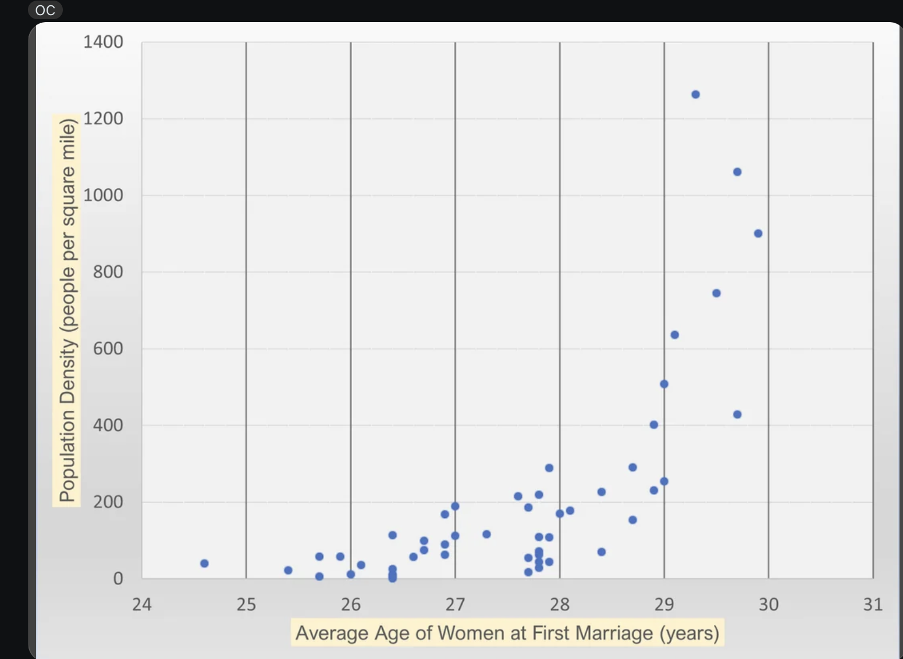

| [home page](README.md) | [visualizing debt](visualizing-government-debt) | [critique by design](critique-by-design) | [final project I](final-project-part-one) | [final project II](final-project-part-two) | [final project III](final-project-part-three) |

## Critique by Design: Redesigning Data Visualization for Better Insight
In this project, I selected a data visualization from MakeoverMonday to critique and redesign. The aim is to create a more effective representation of the data for the intended audience.
I created a standard critique mechanism based on Good Charts and Stephen Few's Data Visualization Effectiveness Profile. 

## Step one: the visualization

I chose the data visualization that describes the Average Age of Women at First Marriage by State vs State Population Density

Source - https://www.reddit.com/r/dataisbeautiful/comments/wzx70h/average_age_of_women_at_first_marriage_by_state/

I had seen couple of other articles on MokeoverMonday, but this stood out because it was comparing age of women at first marriage. I had a little bias as I was curious to know what is the trend about marriages in Unites States. 

_Include link to the original data visualization (or screenshot - make sure to correctly cite your sources, etc.).  Include paragraph or two on why you selected this particular data visualization.  For obvious reasons, the data visualization you select should come from a publicly accessible source._

## Step two: the critique
_Don't forget to complete the Google Form found on the assignment page.  You can summarize your thoughts here._

## Step three: Sketch a solution

## Step four: Test the solution

_Before you conduct your interviews, prepare a simple script.  Use this as a guide and as a way to take notes as you go forward. Come up with your own list of questions you want to ask for the selected visualization. Keep the questions broad so you can get the most value out of your feedback. Then, document answers to your questions here._

Questions to ask (modify these for your own interviews): 

- Can you tell me what you think this is?

- Can you describe to me what this is telling you?

- Is there anything you find surprising or confusing?

- Who do you think is the intended audience for this?

- Is there anything you would change or do differently?

Results: 

_Don't identify or share personally identifiable information (PII) about the people you spoke to._

| Question | Interview 1 | Interview 2 |
|----------|-------------|-------------|
|          |             |             |
|          |             |             |
|          |             |             |

Synthesis: 

_What patterns in the feedback emerge?  What did you learn from the feedback?  Based on this feedback, come up with what design changes you think might make the most sense in your final redesign._

## Step five: build the solution

_Include and describe your final solution here. It's also a good idea to summarize your thoughts on the process overall. When you're done with the assignment, this page should all the items mentioned in the assignment page on Canvas(a link or screenshot of the original data visualization, documentation explaining your process, a summary of your wireframes and user feedback, your final, redesigned data visualization, etc.)._

