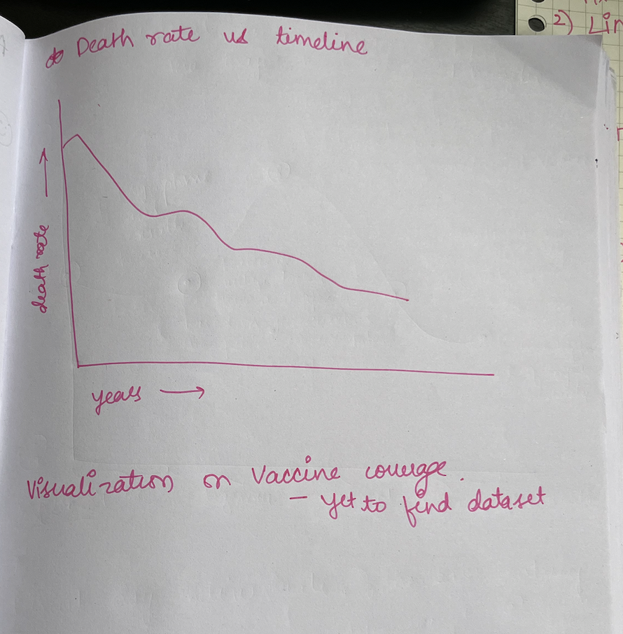
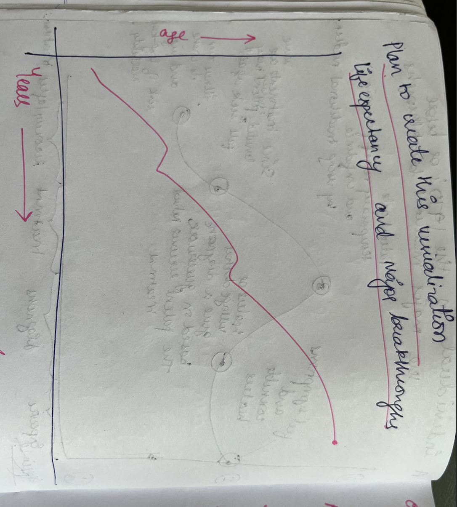
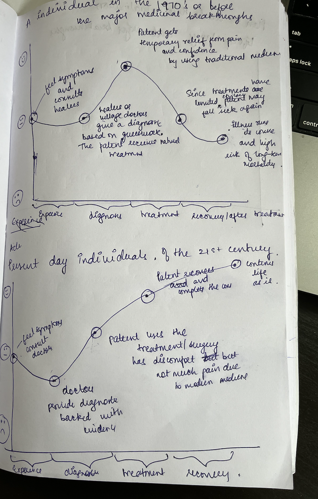

| [home page](https://cmustudent.github.io/tswd-portfolio-templates/) | [visualizing debt](visualizing-government-debt) | [critique by design](critique-by-design) | [final project I](final-project-part-one) | [final project II](final-project-part-two) | [final project III](final-project-part-three) |

Outline

The project will explore the profound effects of modern medicine on human health, focusing on its role in increasing life expectancy and improving the quality of life. While natural remedies may be effective for minor ailments, modern medicine, especially in the form of surgeries, vaccines, and treatments for age-related diseases, has been key in combating serious illnesses. My goal is to educate and communicate how modern medicine can change lives, emphasizing trust in surgical procedures and medical technologies to increase life expectancy.

The target audience includes conservative or older individuals who may believe in the sufficiency of natural remedies and might be skeptical of modern medical interventions. This project aims to educate them on the critical role of modern medicine in improving health outcomes.

Project Structure

The project will follow a clear story arc that emphasizes the progression of modern medicine's role in increasing life expectancy. The key sections include:

Introduction:

Defining modern medicine and its significance with examples.
Highlighting the importance of surgical procedures and trusting technology.

Medical Breakthroughs:

Showcasing major advancements in the field of medicine (e.g., vaccines, antibiotics, vitamins, surgical technology).

Impact on Life Expectancy:

Presenting data on how life expectancy has dramatically improved due to these advancements.

Current Challenges:

Addressing concerns around accessibility, affordability, and public opinion about modern medicine, including skepticism toward vaccines and surgeries.

Conclusion:

Summarizing the long-term benefits of modern medicine.
Advocating for trust in new medical inventions and procedures for a healthier future.

Project Structure:

Setup: Understanding Modern Medicine’s Role

In this phase, I will define modern medicine and establish its significance, setting the foundation for the rest of the project.

Defining Modern Medicine: Provide a clear explanation of modern medicine and its advancements, including examples such as vaccines, antibiotics, and surgical innovations.
Data Visualizations: Introduce visualizations to show the global improvements in life expectancy due to medical advancements. This will include comparisons of life expectancy trends across different time periods and regions, highlighting how medical interventions have improved human health.

Sketch Ideas:

Line Chart: A visualization showing the increase in life expectancy globally since the advent of modern medicine, especially highlighting pivotal moments like the discovery of vaccines or antibiotics.

Conflict: Addressing Skepticism and Challenges

Here, I will present the core conflict: the skepticism of some individuals about modern medicine and its efficacy, especially in comparison to natural remedies. This section will focus on data-backed evidence that challenges these beliefs.

Unveiling the Impact of Medical Breakthroughs: Visualizations will illustrate how life expectancy has dramatically increased over time, particularly in regions where vaccines, antibiotics, and surgeries have become commonplace.

Comparing Medical and Natural Approaches: Show data that contrasts life expectancy and recovery rates between those who rely solely on natural remedies versus those who use modern medical treatments.

Additionally, this section will address other current challenges in modern medicine, such as accessibility, affordability, and public skepticism about vaccines and medical technologies.

Sketch Ideas:

Comparative Bar Chart: A side-by-side comparison of the impact of modern medicine (e.g., vaccination rates vs. disease eradication) and natural remedies on health outcomes.
Time-Scale Visualizations: Daily, monthly, and yearly time savings in treatment and recovery due to modern medicine, contrasted with natural treatments.
Resolution: Advocating for Mindful Medical Choices
In this final phase, I will propose practical strategies and a call to action for trusting modern medical interventions and making informed health decisions.

Emphasizing Long-Term Benefits: Summarize the long-term health and life expectancy improvements enabled by modern medicine, supported by data visualizations showing decreases in mortality rates and increases in lifespan.
Suggesting Behavioral Changes: Encourage people to trust modern medicine when appropriate, educating the audience on the balance between natural remedies for minor ailments and modern treatments for more serious conditions.
Call to Action: Urge the audience to reflect on the benefits of modern medicine and advocate for the use of new medical technologies for a healthier and longer life.
Sketch Ideas:

Pie Chart: Visualizing a balanced approach to healthcare, showing a breakdown of when to use modern medicine versus natural remedies.
Journey Map: Illustrating the medical journey from the past to the present, showing how medical interventions can drastically improve survival rates and quality of life.
Initial Sketches

Initial Sketches

The data visualizations will help tell the story of modern medicine's impact on life expectancy. Initial ideas for visualizations include:

Line Chart: Illustrating the trend in life expectancy improvements over time due to medical advancements, vaccines, and antibiotics.
Comparative Timeline: A historical journey map showing key medical breakthroughs (e.g., vaccines, antibiotics) and their correlation to major increases in life expectancy.
Journey Map: Highlighting the stark contrast between medical care in the 17th century and today, focusing on how treatment and survival outcomes have improved.
>
 
 
 

Text here...

https://www.forbes.com/sites/joshuacohen/2024/07/09/modern-versus-natural-medicine-is-a-false-dichotomy/

The visualizations aim to show impact of modern medicine on human health by comparing key metrics like death rates and life expectancy over time, as well as contrasting the medical journey of individuals from the 17th century to the present day. A line chart will show the reduction in death rates over the years due to advancements in treatments and vaccines, while another visualization will link major medical breakthroughs to increases in life expectancy. A journey map will highlight the contrast between how illnesses were diagnosed and treated in the past compared to the comprehensive and effective medical care available today and showcasing survival outcomes.

# The data

The Data
The primary data sources for this project focus on life expectancy trends, medical breakthroughs, and the impact of vaccinations, such as the eradication of polio.

Life Expectancy Data (World Bank):

This dataset tracks life expectancy globally from 1960 to the present. The data will be used to highlight trends in how life expectancy has increased over time and how key medical breakthroughs correlate with these improvements. I will use this data to show the significant shifts in life expectancy as modern medicine advanced, specifically in regions where vaccines and other medical treatments became more accessible.

Source: World Bank Life Expectancy

Medical Advances and Life Expectancy (Swiss Re SONAR):

This source discusses the direct relationship between medical advances and life expectancy improvements. It provides a timeline of advancements, which I will use to support my analysis of specific medical breakthroughs (e.g., vaccines, antibiotics) and their influence on health outcomes.

Source: Swiss Re - Medical Advances

Vaccine Development Timeline (NCBI):

This table outlines the development timeline of key vaccines, including smallpox, polio, and measles. It will help establish a historical context for the role vaccines have played in public health improvements, which will be visually compared to the life expectancy data.

Source: NCBI - Vaccine Development

Together, these datasets will help demonstrate how advancements in modern medicine have not only extended life expectancy but also contributed to the overall improvement of public health by preventing and eradicating life-threatening diseases.

| Name                                | URL                                                                                  | Description                                                              |
|-------------------------------------|--------------------------------------------------------------------------------------|--------------------------------------------------------------------------|
| World Bank Life Expectancy Data      | https://data.worldbank.org/indicator/SP.DYN.LE00.IN                                   | Tracks global life expectancy from 1960 to the present, showing trends in how medical advancements have increased life expectancy. |
| Swiss Re - Medical Advances          | https://www.swissre.com/institute/research/sonar/sonar2023/medical-advances-life-expectancy.html | Discusses the relationship between medical advances and improvements in life expectancy, providing a timeline of key breakthroughs. |
| NCBI - Vaccine Development           | https://www.ncbi.nlm.nih.gov/pmc/articles/PMC8386248/table/TAB1/                      | Provides a timeline of key vaccines (e.g., smallpox, polio) and their role in improving public health outcomes. |
| Microbes, Science, and Vaccines      | https://ourworldindata.org/microbes-battle-science-vaccines                           | Discusses the history of vaccines and how they have been used to fight microbes and prevent diseases. |
| Our World in Data - Vaccination      | https://ourworldindata.org/vaccination                                                | Provides comprehensive data on vaccination rates and their impact on global health. |
| Spanish Flu Pandemic                 | https://ourworldindata.org/spanish-flu-largest-influenza-pandemic-in-history          | Details the history and impact of the Spanish Flu pandemic, one of the deadliest influenza outbreaks in history. |

# Method and medium

I plan to complete my final project by using a combination of data visualization tools and storytelling techniques to highlight the advancements in modern medicine and their impact on global health outcomes. I will use Tableau to create interactive visualizations, such as timelines and comparative charts, showing life expectancy trends and medical breakthroughs. These visualizations will be embedded in a GitHub Pages site(here) , where I will also document the key findings and analysis in markdown. 
