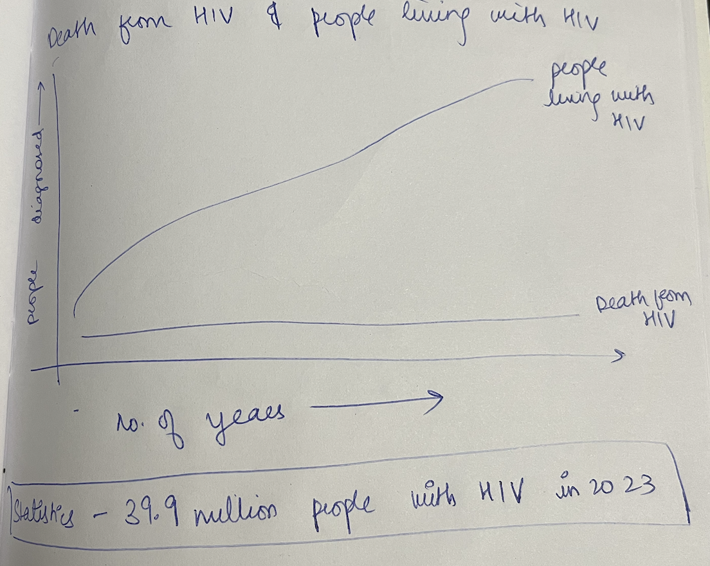
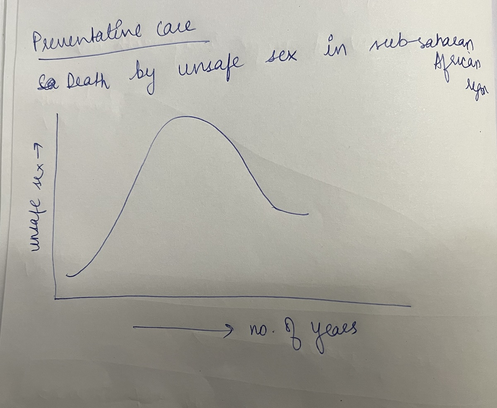
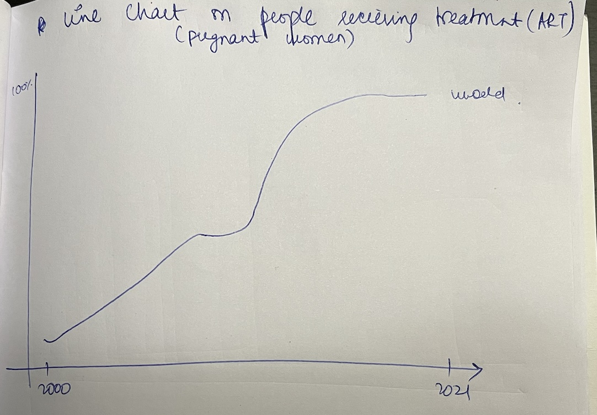
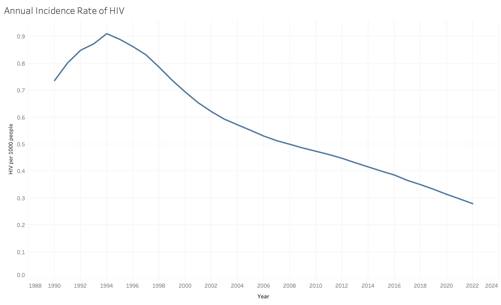
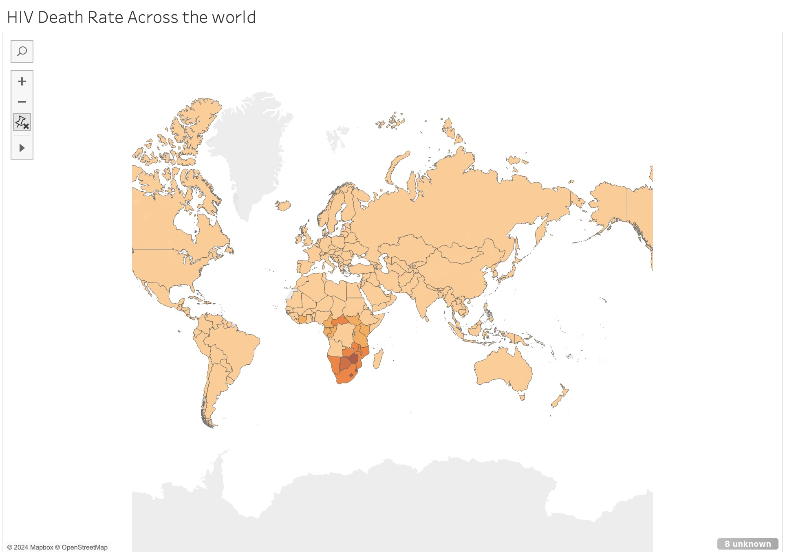
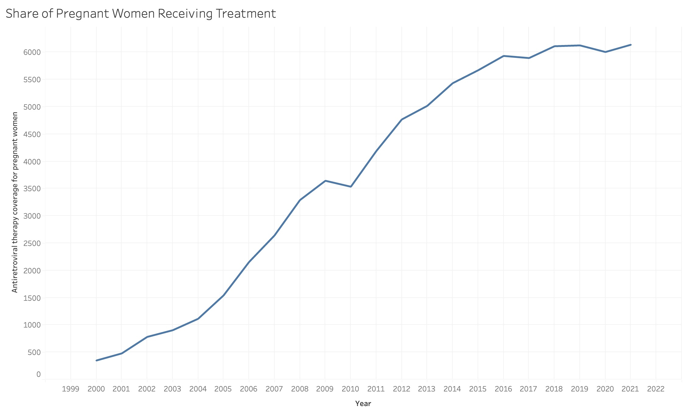
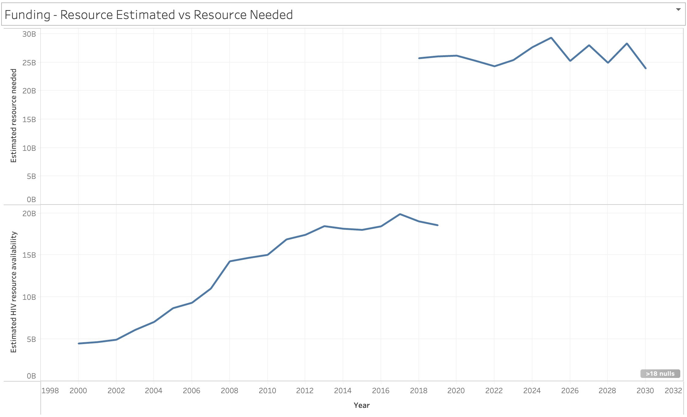

| [home page](https://cmustudent.github.io/tswd-portfolio-templates/) | [visualizing debt](visualizing-government-debt) | [critique by design](critique-by-design) | [final project I](final-project-part-one) | [final project II](final-project-part-two) | [final project III](final-project-part-three) |

# High-Level Summary

This project will explore the stigma associated with HIV/AIDS and its impact on public health efforts, prevention, and treatment. By analyzing trends in public perceptions,  and the global response to the HIV/AIDS epidemic with treatment, the project will highlight how stigma continues to hinder effective interventions. The goal is to shed light on the importance of combating stigma through education and increased accessibility to treatment.

# Project Structure

Setup:

Overview of HIV/AIDS: This section introduces the foundational knowledge about HIV/AIDS, outlining the key facts and figures. It presents the global impact of the epidemic, focusing on the number of people affected, the regions most impacted, and the strides made in research, treatment, and prevention over the years. The goal is to give the audience a clear picture of the current state of the HIV/AIDS crisis, how far we've come, and the challenges that still remain. (These visualizations are yet to be created, unsure about the need).

Visualization: Statistics on HIV/AIDS and timeline of HIV prevelance over the years.

Initial Sketches - 

 

Conflict:

Focus on Stigma and Its Consequences: This section delves into the harmful effects of the stigma surrounding HIV/AIDS. Despite medical advancements, stigma remains a significant barrier. It manifests as social isolation, discrimination, and fear, both for those living with HIV/AIDS and for those seeking prevention and testing services. The section discusses common misconceptions. 

Visualization: A heatmap or bar chart showing regions/countries with education about HIV/AIDS and line chart on preventative care in sub-saharan african region.

Initial Sketches - 

 

Resolution:

Highlighting Solutions: This section will shift the focus to the solutions being implemented to combat HIV/AIDS stigma. Education is the most effective tool for reducing fear and misinformation about the disease. Public awareness campaigns that promote inclusivity and understanding can challenge the stereotypes and fear associated with HIV. 
Focuses on funding in various countries, how treatment averted the death rate and mainly talk about preventative care. 

Visualization: A heat map on funding for HIV , and line chart on treatment over the years.

Initial Sketches -

 

# Wireframes / storyboards
> Using your sketches developed last week, further develop your story outline and relevant components visually through the use of wireframing / storyboards. Using your outline as a guide, include high-fidelity, individual draft data visualizations of the critical elements of your story you want to share with your reader. Note: you can build these elements out directly in Shorthand this week if you wish.  Reminder: this template is intended to help, but it doesn't substitute for reading through the full homework assignment!  The assignment page on Canvas includes many important details for completing Part II of the final project.
>
> Link to ShortHand - https://app.shorthand.com/organisations/JSrgFWI7zn/stories/iB2xs9BZv4
>

The first slide will introduce the connection between HIV and AIDS, with the subtitle "Breaking the Stigma." Initially, I considered using images of famous personalities who have lived with HIV, but due to high costs and copyright restrictions, I opted to simply name these celebrities instead.

The following section will pose an open-ended question: "What do these celebrities have in common?" The answer will reveal that they were all HIV-positive, with some having passed away from AIDS.

In this section, I will present key statistics on HIV, including its prevalence over the years. 

 

Next, I will present data on deaths from AIDS, which will transition to common misconceptions.

The subsequent section will address common misconceptions about HIV, which are AIDS and HIV are same, there is no treatment to HIV, and HIV is communicable even if you are on medication. 

The next section will focus on treatments for HIV and show the impact of treatment.

I will also talk about lack of funding.

I'll discuss the impact of treatments and show visualizations on countries that still struggle with underfunding in their fight against HIV. 
Additionally, I’ll focus on preventative care, with a focus on deaths caused by unsafe sex, particularly in Sub-Saharan Africa.

My main call to action will emphasize the importance of increasing awareness, supporting funding efforts, and promoting preventative care to combat the HIV/AIDS epidemic effectively.

Text here!

# User research 

### Feedback Session One

The initial storyboard for the HIV/AIDS stigma project was tested with three participants – M(32), M(22), F(24).

### Purpose of the Study

The study aims to explore how stigma surrounding HIV/AIDS continues to hinder public health efforts, focusing on prevention and treatment. By understanding personal experiences, societal perceptions, and treatment this project hopes to highlight the ongoing effects of stigma on effective interventions.

### Target Audience and Participant Demographics

Through this study, I aim to reach young adults, healthcare professionals, and policymakers who can influence change. The story is designed to encourage reflection on stigma and its consequences on public health.

For the purpose of this user research, three participants from diverse age groups, gender, and social backgrounds were selected to offer varied perspectives on the issue. These participants were chosen based on their differing levels of awareness and personal connection to the HIV/AIDS epidemic to ensure a broad understanding of the stigma's impact.

### Interview Script: Sectional Review

After walking the research participants through the storyboard, ask them for a sectional review to gather their thoughts and reflections.

#### Section 1: Stigma and Awareness
Ask participants about their knowledge and understanding of the stigma surrounding HIV/AIDS and how it influences their views on public health.

**Questions to be answered:**
- How would you describe your understanding of HIV/AIDS?
- Have you personally witnessed or experienced stigma related to HIV/AIDS in your community or media?
- Do you know the difference between HIV and AIDS?
- Is HIV treatable ?

#### Section 2: Personal Impact of Stigma
Objective: Based on discussions around stigma, ask participants if they feel that stigma affects healthcare access and the willingness of individuals to seek treatment.

**Questions to be answered:**
- Do you think stigma around HIV/AIDS discourages people from seeking treatment or support?
- How do you believe the stigma affects the mental health of individuals living with HIV?

#### Section 3: Personal Reflection
End the study by asking open-ended questions, encouraging participants to reflect on the stigma surrounding HIV/AIDS and its impact on their views.

**Questions to be answered:**
- How has this conversation impacted your understanding of HIV/AIDS stigma?
- What actions do you think could help reduce the stigma surrounding HIV/AIDS?

---

### Interview Script: Overall Questions

After conducting the sectional review, proceed to open-ended questions to gather feedback on the overall features of the story.

1. What did you think about the title of the story? Any suggestions?
2. How engaging did you find the content? Were there any parts that stood out or felt lacking?
3. What do you think of the visuals and overall presentation? Do they support the message?
4. If you were to ask questions at the end of the story, what would those be?
5. What are your thoughts on how the sections are structured?
6. Any other comments or feedback?

| Goal                                     | Questions to Ask                                                                                       |
|------------------------------------------|--------------------------------------------------------------------------------------------------------|
| Feedback on the title                    | What did you think about the title of the story? Any suggestions?                                       |
| Engagement with content                  | How engaging did you find the content? Were there any parts that stood out or felt lacking?              |
| Visual and presentation feedback         | What do you think of the visuals and overall presentation? Do they support the message?                 |
| User-generated questions                 | If you were to ask questions at the end of the story, what would those be?                              |
| Structure and flow                       | What are your thoughts on how the sections are structured?                                              |
| General feedback and additional thoughts | Any other comments or feedback?                                                                         |

Text here!

## Interview findings
> Detail the findings from your interviews. Do not include PII. Capture specific insights where possible.

Text here!

| Questions                              | Interview 1 (briefly describe)                | Interview 2 (briefly describe)               | Interview 3 (briefly describe)              |
|----------------------------------------|----------------------------------------------|---------------------------------------------|---------------------------------------------|
| What do you think about the title?     | "Could include 'stigma' to make the title clearer, and maybe use a lighter image for the profile section." | "Title is fine but could be more engaging."  | "The title is strong and fits the content." |
| Are the section transitions smooth?    | "Transition between statistics and remaining slides feels abrupt. Information on efficacy rates and why treatment is not used across will be useful." | "Sections flow well overall, but transitions could be slower." | "The flow was well done, no issues here."   |
| How effective is the call to action?   | "Don't be too prescriptive with the final call to action." | "Consider including self-reflective questions at the end." | "Great call to action, but keep it open-ended." |
| How do you feel about the tone of the story? | "The tone is a little formal, maybe more conversational?" | "Tone is serious but necessary given the topic." | "Tone was just right, balanced and professional." |
| What do you think about the visualizations? | "There are too many visuals expected. It might be better to focus on a few key ones or combine some for better clarity." | "Some of the visuals are overwhelming. Maybe simplify or consolidate them into fewer charts with better labels." | "A good mix of visuals, but reducing the number of charts could enhance focus." |

# Identified changes for Part III

Next week, I will focus on implementing the following changes to improve the clarity, flow, and engagement of the story based on the insights gathered from the user interviews. These changes aim to enhance both the structure and presentation of the content while ensuring the story remains impactful and accessible.

| Research synthesis                       | Anticipated changes for Part III                                                |
|------------------------------------------|---------------------------------------------------------------------------------|
| Title could be clearer and more direct   | Revise the title to better reflect the focus on HIV/AIDS stigma, using simple and direct language. |
| Section transitions are abrupt in places | Adjust the transitions between sections to ensure smoother flow. |
| Visuals need better clarity and context  | Add contextual annotations to key visualizations and reduce visual size. |
| Too many visualizations may overwhelm viewers | Focus on key visuals by reducing the number of charts, and combine some visuals for better clarity and impact. |
| Final call to action needs to be open-ended | Modify the final call to action to ask reflective questions rather than prescriptive solutions. |
| Starter questions could be simplified    | Simplify starter questions to make them more accessible and easier to answer, leading into deeper discussions. |

In summary, the changes outlined above will help create a more cohesive and engaging narrative. These modifications are essential to making the story more relatable, understandable, and visually appealing, ensuring that readers can reflect on the stigma surrounding HIV/AIDS in a meaningful way.

