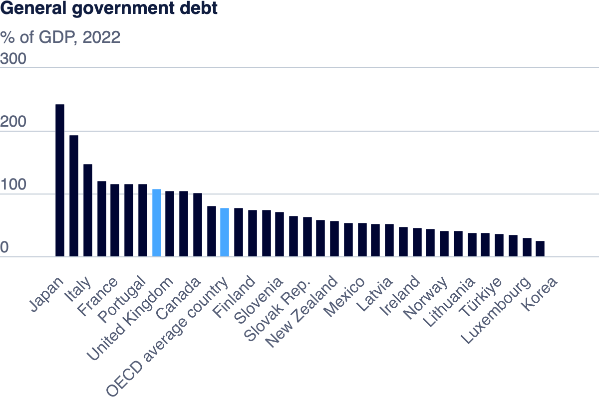

| [home page](README.md) | [visualizing debt](visualizing-government-debt) | [critique by design](critique-by-design) | [final project I](final-project-part-one) | [final project II](final-project-part-two) | [final project III](final-project-part-three) |

# Visualizing Government Debt

## Part one: Working with web-based visualization tools and data

### Government Debt Bar Chart

For Part 1, I utilized the OECD’s web-based visualization tool to create a bar chart showing government debt-to-GDP ratios across several countries. The tool allowed me to customize the chart by selecting a specific year (2022) and filtering countries based on their debt ratios. I downloaded the chart as a .png file and embedded it into my GitHub portfolio page.

This visualization provides a clear snapshot of the debt-to-GDP ratio in a specific year, making it easy to compare countries’ financial health at a glance.
Countries like Japan or Italy have higher debt-to-GDP ratios (taller bars), showing they owe a significant portion of their GDP in debt.
Countries with lower ratios have shorter bars, indicating lower debt relative to their economy.

## Part two: Working with Tableau

<noscript></noscript><object class='tableauViz'  style='display:none;'><param name='host_url' value='https%3A%2F%2Fpublic.tableau.com%2F' /> <param name='embed_code_version' value='3' /> <param name='site_root' value='' /><param name='name' value='GlobalGovernmentDebt-to-GDPRatiosTrendsandComparisonsbyCountry&#47;DataVisualizationofGovernmentDebtRatio' /><param name='tabs' value='no' /><param name='toolbar' value='yes' /><param name='static_image' value='https:&#47;&#47;public.tableau.com&#47;static&#47;images&#47;Gl&#47;GlobalGovernmentDebt-to-GDPRatiosTrendsandComparisonsbyCountry&#47;DataVisualizationofGovernmentDebtRatio&#47;1.png' /> <param name='animate_transition' value='yes' /><param name='display_static_image' value='yes' /><param name='display_spinner' value='yes' /><param name='display_overlay' value='yes' /><param name='display_count' value='yes' /><param name='language' value='en-US' /><param name='filter' value='publish=yes' /></object>

Steps in Tableau:

Dataset Loading: I imported the OECD dataset and set the Time column to Date.

Creating the Highlight Table: I placed Time on Columns, Value on Rows, and Location on the Marks card to differentiate by country.

Sorting: I sorted countries by descending average debt-to-GDP ratio to prioritize those with higher debt.

Color Customization: I used the Orange-Blue Diverging palette, setting 100 as the center. This choice effectively highlighted the divide between countries with debt above or below 100% of GDP.

Filtering: I removed countries with missing data (e.g., Colombia) to maintain clarity.

Final Touches: I added a clear title and ensured hover-over interactions for more detailed insights.

After sharing it to Tableau Public, I copied the embedded code from Tableau Public and pasted it in this Markdown file. I ensured the formatting was consistent for correct rendering. 

Observations:
Key Insights: Japan and Greece showed consistently high debt-to-GDP ratios, while countries like Luxembourg had consistently low ratios.

Diverging Colors: The Orange-Blue palette made it easy to distinguish between countries with higher or lower debt. 

Heat Map: It is a comprehenive chart visualization, coupled with diverging colours makes it easier for the audience to view and gain specific insights from the visualization. 

## Part three: create your own visualization

<noscript></noscript><object class='tableauViz'  style='display:none;'><param name='host_url' value='https%3A%2F%2Fpublic.tableau.com%2F' /> <param name='embed_code_version' value='3' /> <param name='site_root' value='' /><param name='name' value='Debt-to-GDPTrendsinNorthAmerica&#47;Debt-to-GDPTrendsinNorthAmerica' /><param name='tabs' value='no' /><param name='toolbar' value='yes' /><param name='static_image' value='https:&#47;&#47;public.tableau.com&#47;static&#47;images&#47;De&#47;Debt-to-GDPTrendsinNorthAmerica&#47;Debt-to-GDPTrendsinNorthAmerica&#47;1.png' /> <param name='animate_transition' value='yes' /><param name='display_static_image' value='yes' /><param name='display_spinner' value='yes' /><param name='display_overlay' value='yes' /><param name='display_count' value='yes' /><param name='language' value='en-US' /><param name='filter' value='publish=yes' /></object>
                

For this part, I created a line chart to visualize debt-to-GDP trends for North America (USA, Mexico, and Canada). This chart focuses on how each country’s debt ratio has evolved over time, making it easy to identify key trends, such as the USA’s debt spike after 2008 and Mexico's gradual increase post 2003.Canada has a relatively stable debt ratio, with a dip in 2008 followed by an increase.

I chose the line chart because it clearly shows changes over time, which is crucial for understanding debt patterns. Unlike the bar chart or heat map, which emphasize comparison or magnitude, the line chart excels in showcasing continuous data and highlighting temporal shifts.

Comparison to Other Visualizations
Bar Chart (Part 1): The bar chart used earlier focuses more on comparing the debt-to-GDP ratio for a specific year across multiple countries. It’s helpful for getting a snapshot of the current debt levels but doesn’t show trends or how countries' debts change over time.
Heat Map (Part 2): The heat map offers a comprehensive comparison of many countries and years. However, it lacks the clarity that a line chart provides when focusing on a smaller subset of countries over time. While the heat map uses color to highlight differences, the line chart uses the x-axis for time, which more effectively shows progression or regression.

Review and Reflection
After reviewing my work, I made sure that someone unfamiliar with the dataset would be able to follow my process step by step. The structure is clear, starting with data loading which we have done previously, moving to building the visualizations by filtering on location, and then comparing them by selecting a line chart. 

This line chart visualization effectively tells a story about debt trends in North America, and I would be happy to present this as an example of my work. It’s visually clear, easy to interpret, and successfully conveys the key insights needed for this type of analysis.

